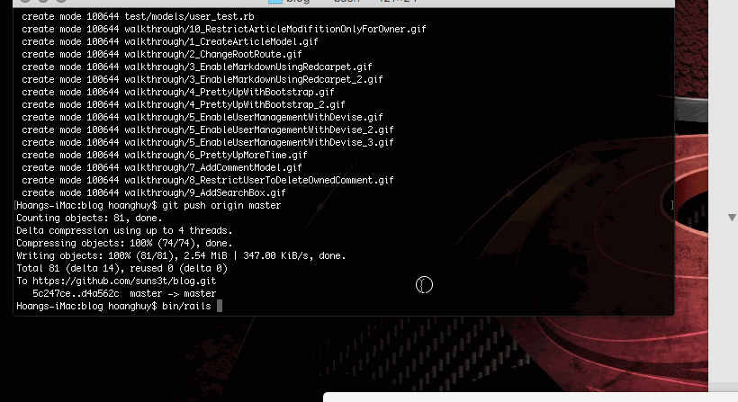
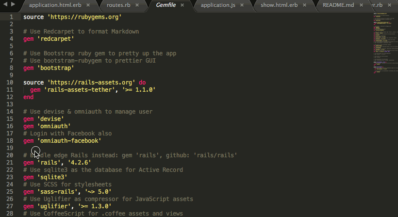
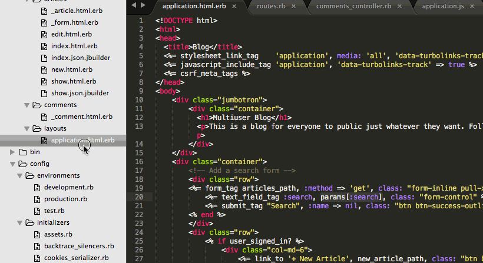

# Pre-work - *Multiuser Blog with Markdown format*

**MultiuserBlog** is a Ruby on Rails blog application.

Submitted by: **Huy Ngoc Hoang**

Time spent: **10** hours spent in total

URL: **Insert your Heroku URL here**

## User Stories

The following **required** functionality is complete:

* [x] User can create a new post, formatted using the Markdown language.
* [x] User can edit an existing post.
* [x] There is one post that introduces the App Creator with name, picture.
* [x] User can delete stories, with an alert that asks the user to confirm.
* [x] User see a search form on the Posts page.
* [x] User can submit a search term to find all posts bywith titles containing the search term.

The following **optional** features are implemented:

* [ ] There is a "navbar" that is responsive to window size similar to http://v4-alpha.getbootstrap.com/examples/navbar/. 
* [ ] User can see how many views a post has. 
* [ ] User can leave a comment on a post.
* [ ] User can add "tags" to a post, and filter posts by tag. 

The following **additional** features are implemented:

- [x] User management using Devise.
- [x] Many users can add in their own article.
- [x] Only owner article can edit and delete their stories.
- [x] User login with Facebook.

## Video Walkthrough 

Here's a walkthrough of implemented user stories:

> HINT: You can put a `walkthrough.gif` file in your project folder, add to git, and use the following syntax to embed it:  
> `` 
> 

- **Create Article Model**: Rails Generate using Scaffold to create Article model with title and body as string. Change the root route to article#index

- **Enable Markdown**: Add in Gem named Redcarpet. Run Bundle Install. Create @markdown variable on Article Controller. Render Markdown on Article Body in the Article Template.

- **Pretty Up With Bootstrap**: Add in Gem named bootstrap, run Bundle Install. Import bootstrap on scss and js file. You are ready to use Bootstrap in the project.

- **Enable User Management With Devise, login using Facebook**: Add in Devise Gem. Setup model User inherit from Devise model. Setup APP_ID and APP_SECRET in order to login with Facebook. Add login path to template. In Article controller, change to current_user to save the signed in user as owner of article. Add user_id into Article table.

- **Pretty Up One More Time** Decorate notice with Alert Component, dismissable from Bootstrap. Use Card Component from Bootstrap to represent each Article.

- **Add in Comment Model** Using Scaffold to generate Comment model with text as string. Add in user_id and article_id to the Comment table. Set up Association with User and Article model. Migrate database. Nest comment routes inside article routes. Change the Comment Controller to be able to save current article, current user. Restrict only comment owner to be able to delete their comment.

- **Restrict Article Modification Only For Owner** Create Article Owner function to check if current signed in is the article owner. Require to run this function before doing modification fuctions. Only show modification buttons on template if the owner of that article is signed in.

- **Add Simple Search Box** Using form_tag to create a simple Search box. Pretty it up with form-inline from Bootstrap. Creat a simple search function by title in Article Model. Use that search function inside index function on Article Controller.

GIF created with [LiceCap](http://www.cockos.com/licecap/).

## Notes

Describe any challenges encountered while building the app:

- Install Rails on Mac OS X, need to use **rbenv** [Link Here](https://gorails.com/setup/osx/10.11-el-capitan)
- Take time to figure out how to cope with model belongs to 2 other models
- Read article about how to use Devise with Facebook login

## License

    Copyright [2016] [Huy Ngoc Hoang]

    Licensed under the Apache License, Version 2.0 (the "License");
    you may not use this file except in compliance with the License.
    You may obtain a copy of the License at

        http://www.apache.org/licenses/LICENSE-2.0

    Unless required by applicable law or agreed to in writing, software
    distributed under the License is distributed on an "AS IS" BASIS,
    WITHOUT WARRANTIES OR CONDITIONS OF ANY KIND, either express or implied.
    See the License for the specific language governing permissions and
    limitations under the License.
